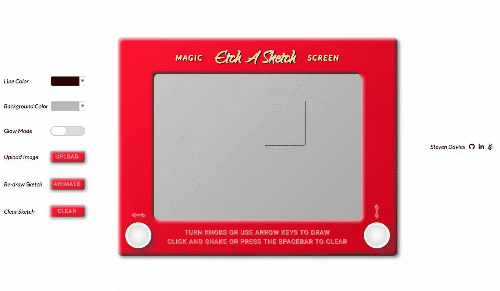
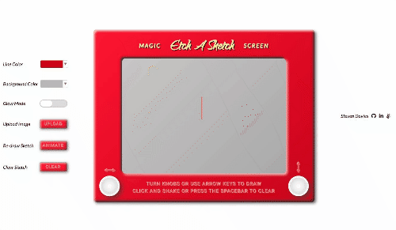
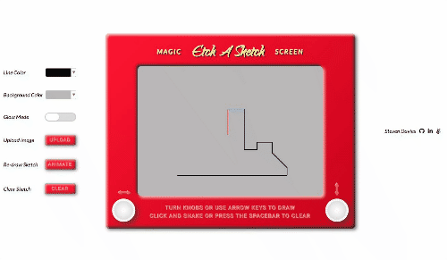
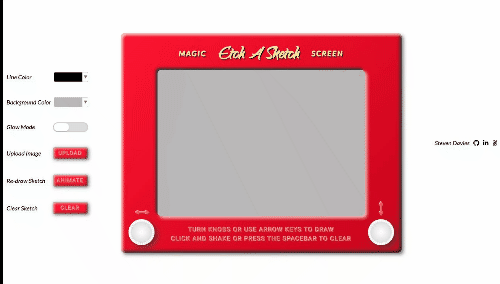

The Etch-A-Sketch has arrived for the next generation. Experience this new take on the classic drawing toy, and utilize novel functionality such as color choice and image tracing to bring your sketches to life.

[LIVE SITE](https://s-davies.github.io/etch-a-sketch/)

# Features

Turn knobs or use arrow keys to draw

Shake to clear sketch

Pick your line and background colors

Draw all night with Glow Mode

Upload an image onto the sketch area to serve as a tracing guide

See your sketch come to life with Re-Draw

# Technologies

Built with JavaScript and jQuery
<!-- 
**Packages** -->

# Code Snippets

# Future Improvements

- Add demo sketches
- Detect accelerometer shakes on mobile
- Change background picture rotation